# Video2Knowledge

> 将视频、音频和在线链接转化为可检索、可复用、可发布的结构化知识资产。

[](https://www.python.org/)
[](https://fastapi.tiangolo.com/)
[](https://www.sqlite.org/)
[](https://nextjs.org/)
[](https://react.dev/)
[](https://tailwindcss.com/)
[](LICENSE)

---

## 项目简介

技术视频、课程录屏、会议分享、播客音频和在线平台链接里往往包含大量高价值信息，但原始媒体不方便搜索、引用、协作和二次创作。Video2Knowledge 面向个人学习者、内容创作者和技术团队，提供一条从媒体素材到知识资产的 AI 流水线：统一抽取音频，完成语音转录，识别章节结构，提取概念、框架、方法、工具、论文、代码示例和洞察，并生成可发布的 Markdown 文章。

因此，项目不再只是“视频转技术博客”。博客是最终产物之一，系统真正沉淀的是一组可回放、可导出、可复用的阶段化知识结果，包括 WAV 音频、带时间戳转录、章节 JSON、知识 JSON、Markdown、SRT、TXT 和完整阶段数据。

## 核心能力

### 多源媒体输入

支持本地视频、本地音频和 URL 链接三类输入。`SourceAdapter` 将不同来源统一转换为 16kHz mono WAV，让后续 ASR、章节划分、知识提取和文章生成都基于同一个稳定输入。

### 双 ASR 通道

默认使用 `faster-whisper large-v3`，自动检测 CUDA 并回退到 CPU int8。也可以切换到 MIMO-ASR：系统会把长音频切成 MP3 分片，并发请求接口，并支持失败重试和心跳进度。

### 结构化知识提取

DeepSeek LLM 会从转录文本中生成章节结构，并抽取概念、框架、方法、工具、论文、代码示例、洞察等知识字段。相比只拿到一篇文章，这些中间结果更适合进入知识库、检索系统或后续自动化流程。

### 流式内容生成

文章生成阶段使用 DeepSeek 流式接口，后端通过线程和 `asyncio.Queue` 桥接同步 HTTP 流与异步 SSE，前端可以实时显示生成中的 Markdown 内容。

### Prompt 模板与预设管理

内置章节划分、知识提取、文章生成的 System/User Prompt，并支持在前端可视化编辑。用户可以创建多套生成预设，用于不同写作风格、行业场景或输出要求。

### 资产管理与多格式导出

处理完成的任务会进入资产列表，支持搜索、状态筛选、查看详情、重新处理、仅重新生成文章、删除，以及导出 Markdown、SRT、TXT、JSON。

## 效果展示

> **演示素材**：以下流程使用来自 B 站（哔哩哔哩）的雅思学习视频《2026 年 5—8 月雅思口语新题全部 Part 1 高分示范》作为输入样例，展示从视频导入、语音转录到知识提取和文章生成的完整过程。

### 1. 导入视频

支持上传本地视频、音频，也可以直接粘贴 YouTube、Bilibili 等在线平台链接，并在开始处理前选择 Prompt 预设和 ASR 模型。

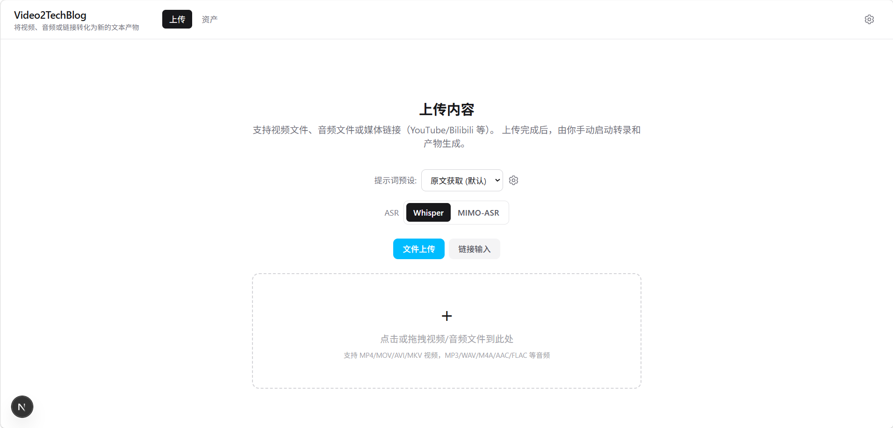

### 2. 跟踪处理进度

系统按照“音频提取 → 语音转录 → 章节划分 → 知识提取 → 产物生成”的顺序执行。处理 B 站雅思视频时，页面会同步展示当前阶段、单步进度、整体进度和后续等待任务。

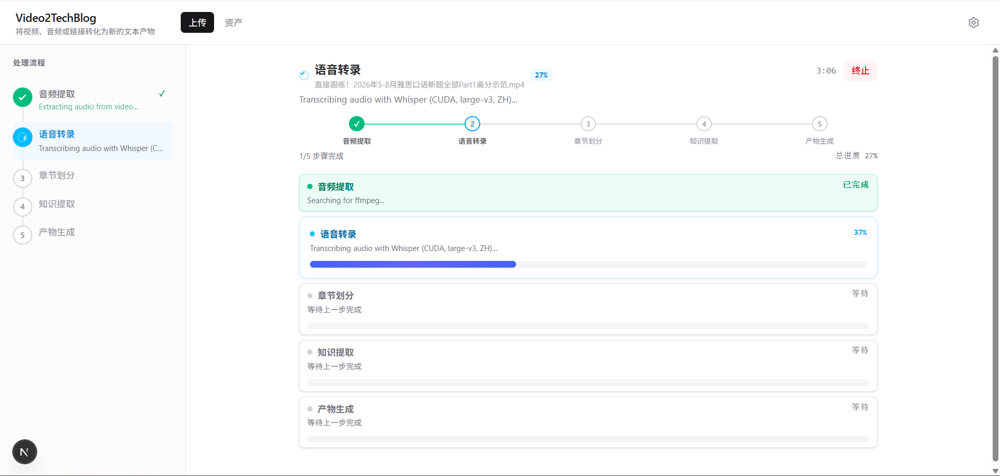

### 3. 回看原始视频与标准音频

任务完成后，详情页首先保留原始 B 站视频，随后提供抽取并标准化后的音频，方便逐段核对、在线播放或下载。

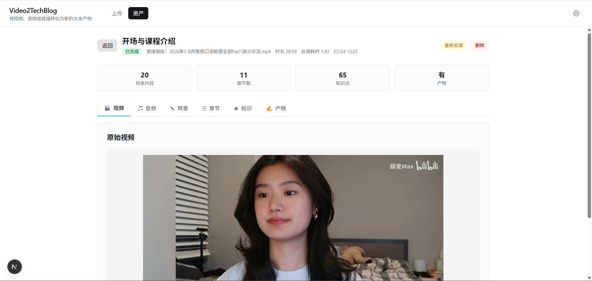

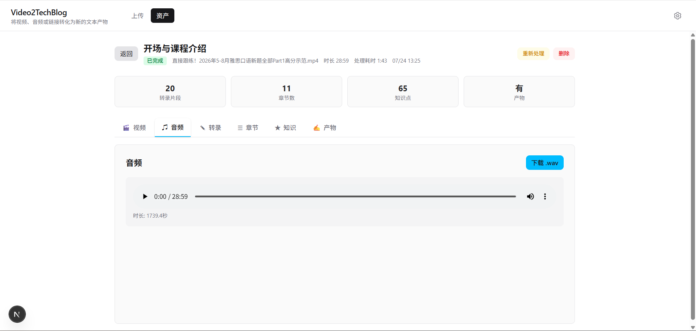

### 4. 检查转录与结构化知识

带时间戳的中英混合转录文本可导出为 TXT 或 SRT；知识提取结果会进一步整理雅思口语备考概念、表达方法和学习框架，并支持导出 JSON。

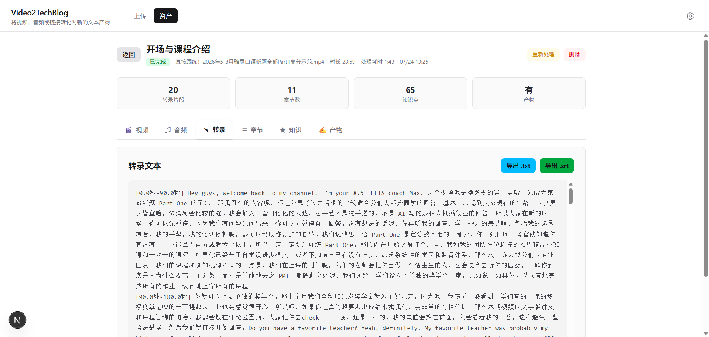

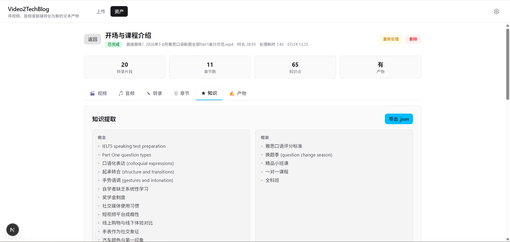

### 5. 生成可发布产物

系统根据转录、章节和知识结果生成 Markdown 文章，可在页面中预览、重新生成或导出。

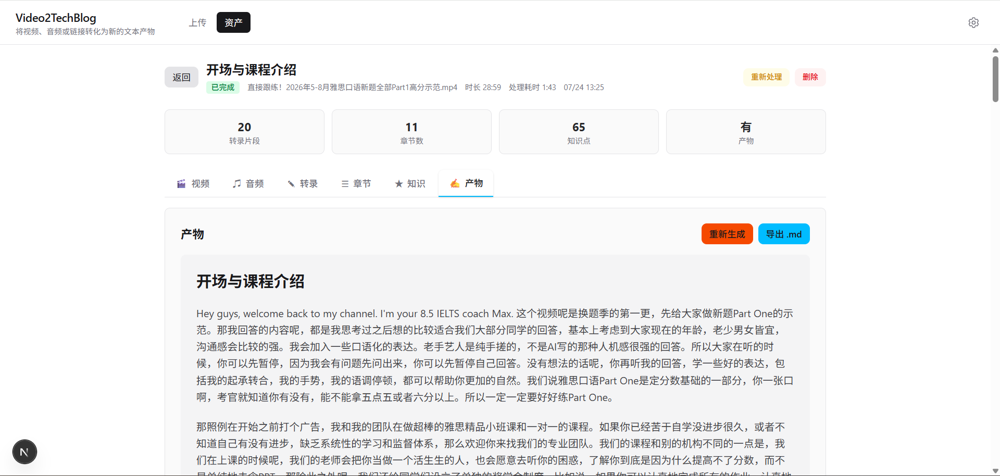

### 6. 沉淀到资产库

所有已处理任务最终汇总到资产列表，可以按标题搜索、按状态筛选，并继续查看详情、重新处理或删除。

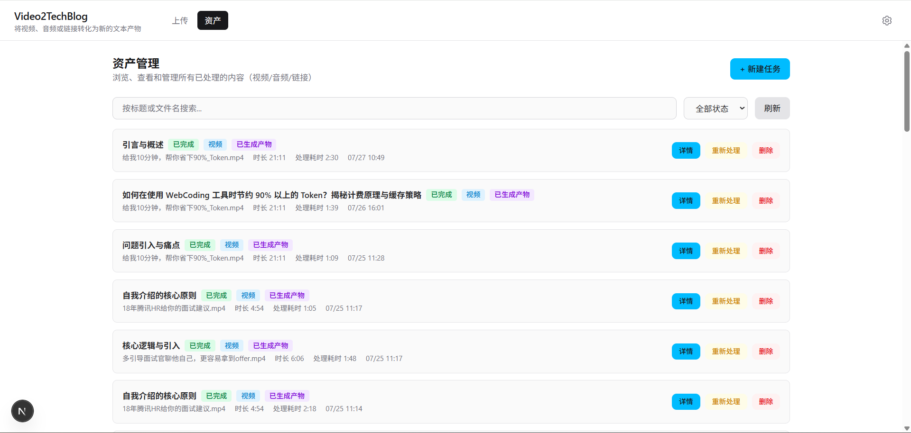

## 应用场景

- **学习资料沉淀**：把长课程、讲座和公开课整理成章节、知识点、摘要和可复习文本。
- **团队知识库建设**：把内部分享、会议录屏、技术评审沉淀为结构化文档，减少重复讲解。
- **内容二次创作**：从视频素材快速生成博客草稿、字幕、摘要和 JSON 数据，用于公众号、GitHub、知识库或自动化发布。
- **研究与资料整理**：从访谈、播客、研讨会中提取方法、工具、论文和洞察，方便后续分析。
- **视频资产管理**：保留原始媒体、标准音频和各阶段 AI 结果，让同一素材可以反复生成不同版本产物。

## 安装部署

### 环境要求

| 依赖 | 建议版本 | 用途 |
| --- | --- | --- |
| Windows PowerShell | 5+ | 运行一键启动脚本 |
| Conda / Miniconda | 最新稳定版 | 管理 Python 3.10 环境 |
| Node.js | 18+ | 前端依赖安装和 Next.js 开发服务 |
| ffmpeg / ffprobe | 最新稳定版 | 音视频抽取、转码和时长探测 |
| DeepSeek API Key | 必需 | 章节划分、知识提取、文章生成 |
| MIMO API Key | 可选 | 使用 MIMO-ASR 时需要 |

### 方式一：让 AI 帮你安装

把下面这段话交给你的 AI 编程助手：

```text
请帮我在 Windows 上运行 Video2Knowledge：
1. 检查 Conda、Node.js、ffmpeg 是否可用。
2. 如果缺少依赖，请给出安装建议。
3. 复制 backend/.env.example 为 backend/.env，并提醒我填写 DEEPSEEK_API_KEY。
4. 执行 .\start.ps1 启动后端 8001 和前端 3002。
5. 启动成功后告诉我访问 http://localhost:3002。
```

### 方式二：脚本自动启动

```powershell
git clone https://github.com/guyue356/Video2Knowledge.git
cd Video2Knowledge
copy backend\.env.example backend\.env
# 编辑 backend\.env，填写 DEEPSEEK_API_KEY；如需 MIMO-ASR，再填写 MIMO_API_KEY
.\start.ps1
```

脚本会检查 Conda、Node.js、ffmpeg，创建或复用 `video2knowledge` Conda 环境，安装后端与前端依赖，并启动：

- 前端应用：http://localhost:3002
- 后端接口：http://localhost:8001/docs

停止服务：

```powershell
.\stop.ps1
```

### 方式三：手动启动

```powershell
# 后端
cd backend
conda create -n video2knowledge python=3.10 -y
conda activate video2knowledge
pip install -r requirements.txt
uvicorn app.main:app --reload --port 8001
```

```powershell
# 前端
cd frontend
npm install
npm run dev
```

## 快速开始

1. 打开 `http://localhost:3002`。
2. 选择 Prompt 预设和 ASR 模型：`Whisper` 或 `MIMO-ASR`。
3. 上传视频/音频文件，或提交 URL 链接。
4. 点击开始处理，等待音频规范化、转录、章节划分、知识提取和文章生成。
5. 在阶段结果页查看知识资产，并按需导出 `md`、`srt`、`txt` 或 `json`。

## 使用说明

### 输入方式

| 输入类型 | 说明 |
| --- | --- |
| 视频文件 | 通过 ffmpeg 抽取音频并标准化为 WAV |
| 音频文件 | 直接重编码为 16kHz mono WAV |
| URL 链接 | 通过 yt-dlp 下载音频，适合 Bilibili、YouTube 等平台 |

部分平台需要登录态或会员权限，可以在 `backend/.env` 中通过 `YTDLP_COOKIES_PATH` 指定 cookies 文件。

### 阶段结果

| 阶段 | 输出 |
| --- | --- |
| `extract_audio` | 标准 WAV 音频、媒体时长 |
| `transcribe` | 带时间戳的转录文本和分段列表 |
| `segment_chapters` | 章节标题、摘要、时间范围、重要性评分 |
| `extract_knowledge` | 结构化知识 JSON |
| `generate_blog` | Markdown 文章正文和标题 |

### 导出格式

| 格式 | 用途 |
| --- | --- |
| Markdown | 发布到博客、GitHub、知识库 |
| SRT | 字幕文件 |
| TXT | 纯文本转录或正文 |
| JSON | 阶段结果、知识结构和自动化集成 |

## 系统架构

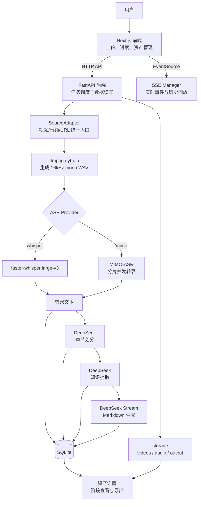

前端负责交互、进度展示和资产复用；后端负责输入适配、任务生命周期、AI 调用和持久化；SSE Manager 维护每个任务的事件队列和历史事件，支持刷新页面后的进度回放。

## 核心工作流程


1. **创建任务**：上传接口只保存输入并创建 `pending` 任务，真正处理由 `/api/task/{id}/start` 触发。
2. **输入适配**：`VideoFileAdapter`、`AudioFileAdapter`、`UrlAdapter` 将来源统一转换为 WAV。
3. **语音转录**：按用户选择使用 Whisper 或 MIMO-ASR；MIMO-ASR 支持分片、并发、重试和可选串行 fallback。
4. **LLM 分析**：章节划分和知识提取使用非流式 DeepSeek 请求，并解析 JSON 结果。
5. **内容生成**：文章生成使用流式 DeepSeek 请求，前端实时显示 Markdown。
6. **结果沉淀**：完整阶段 JSON 保存到 `stage_results`，文章保存到 `blogs`，资产页可重复查看和导出。

## AI 工作流程

### Prompt Pipeline

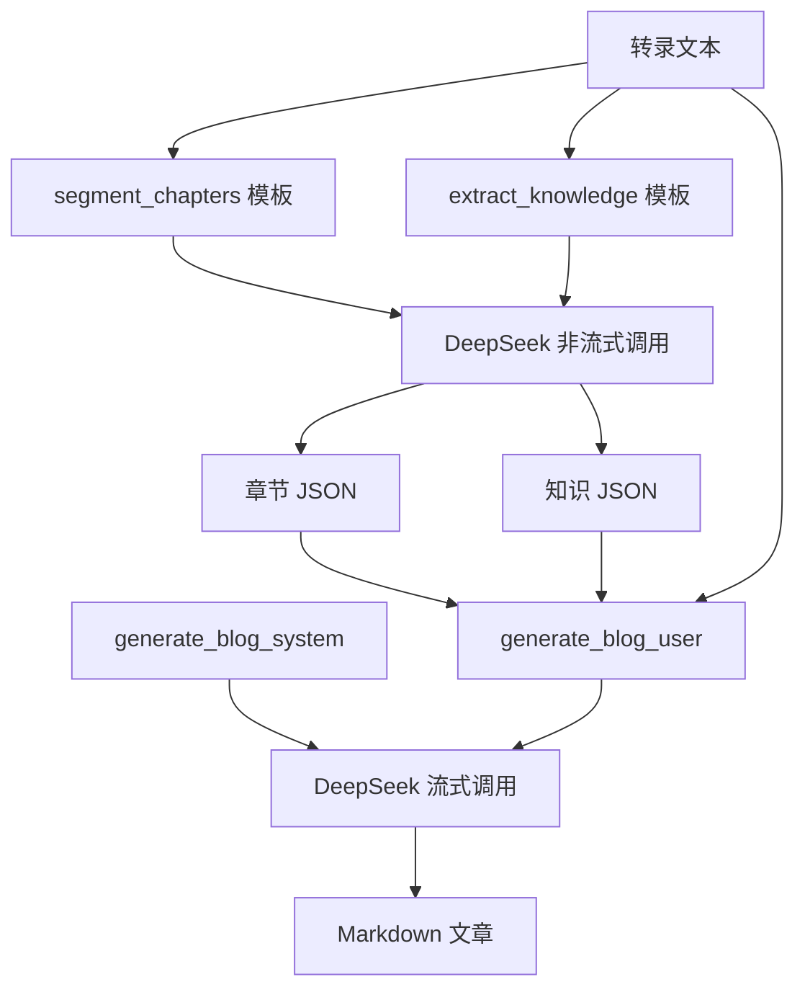

### Prompt 设计要点

- 转录内容会被包裹在 XML 风格标签中，提示模型把标签内文本视为原始数据。
- 章节和知识阶段要求返回 JSON，后端会剥离 Markdown code fence 后再解析。
- 文章生成阶段由 System Prompt 定义写作角色和输出要求，User Prompt 注入章节、知识和转录文本。
- Prompt 模板存储在 `prompt_templates` 表中，预设存储在 `prompt_presets` 表中，支持前端热更新。

### LLM 使用方式

| 环节 | 模型/接口 | 说明 |
| --- | --- | --- |
| 章节划分 | DeepSeek Chat Completions | 非流式请求，输出章节 JSON |
| 知识提取 | DeepSeek Chat Completions | 非流式请求，输出结构化知识 JSON |
| 文章生成 | DeepSeek Chat Completions Stream | 流式输出 Markdown |
| 云端 ASR | MIMO-ASR | 可选，长音频分片并发识别 |
| 本地 ASR | faster-whisper large-v3 | 默认，支持 CPU/GPU |

## 技术栈

| 层级 | 技术 | 用途 | 选型理由 |
| --- | --- | --- | --- |
| 前端 | Next.js 16 + React 19 | 单页 Web 应用 | App Router 与 React 生态成熟 |
| 前端样式 | Tailwind CSS 4 | 响应式 UI | 快速构建可维护的界面样式 |
| Markdown | react-markdown + remark-gfm + rehype-highlight | 文章渲染 | 支持 GFM 和代码高亮 |
| 后端 | FastAPI + Uvicorn | API 与 SSE 服务 | 原生 async，OpenAPI 文档友好 |
| 数据库 | SQLite + SQLAlchemy async | 本地持久化 | 零运维，适合个人和小团队单机部署 |
| 本地 ASR | faster-whisper large-v3 | 语音识别 | 可用 CPU/GPU，部署成本低 |
| 云端 ASR | MIMO-ASR | 语音识别 | 长音频分片并发，适合替代本地转录 |
| LLM | DeepSeek API | 章节、知识、文章生成 | OpenAI 兼容接口，中文写作表现好 |
| 媒体处理 | ffmpeg / ffprobe | 抽音频、转码、探测时长 | 音视频处理事实标准 |
| URL 下载 | yt-dlp | 平台链接下载 | 覆盖平台广，维护活跃 |
| 实时进度 | sse-starlette + EventSource | 推送任务状态 | 简单稳定，适合单向任务流 |

## 项目结构

```text
Video2Knowledge/
├── backend/                         # FastAPI 后端
│   ├── app/
│   │   ├── main.py                  # API 路由、任务调度、导出接口
│   │   ├── config.py                # 路径、模型、ASR、环境变量配置
│   │   ├── models/
│   │   │   ├── database.py          # SQLAlchemy 表结构与初始化
│   │   │   └── schemas.py           # Pydantic 请求/响应模型
│   │   └── pipeline/
│   │       ├── sources.py           # 多源输入适配器
│   │       ├── nodes.py             # AI 流水线节点
│   │       ├── sse_manager.py       # SSE 队列和历史事件管理
│   │       └── graph.py             # 兼容入口
│   ├── requirements.txt             # Python 依赖
│   └── .env.example                 # 环境变量模板
├── frontend/                        # Next.js 前端
│   ├── src/app/
│   │   ├── page.tsx                 # 主界面：上传、处理、资产管理
│   │   ├── StageViewer.tsx          # 阶段结果展示与导出按钮
│   │   ├── MarkdownRenderer.tsx     # Markdown 渲染
│   │   ├── PromptSettings.tsx       # Prompt 模板编辑
│   │   ├── PresetSelector.tsx       # Prompt 预设选择
│   │   ├── PresetManager.tsx        # Prompt 预设管理
│   │   └── useStageData.ts          # 阶段数据加载 Hook
│   └── package.json                 # 前端依赖与脚本
├── storage/                         # 运行时数据，已 gitignore
│   ├── videos/                      # 上传视频
│   ├── audio/                       # 标准化音频
│   ├── output/                      # 导出文件
│   └── app.db                       # SQLite 数据库
├── Assets/                          # README 截图
├── docs/                            # 设计与方案文档
├── start.ps1                        # Windows 一键启动
├── stop.ps1                         # Windows 停止脚本
├── AGENTS.md                        # Codex 项目指引
├── CLAUDE.md                        # Claude 项目指引
└── LICENSE                          # MIT License
```

## 配置说明

主要配置位于 `backend/app/config.py`，运行时通过 `backend/.env` 覆盖。

| 变量 | 必需 | 默认值 | 说明 |
| --- | --- | --- | --- |
| `DEEPSEEK_API_KEY` | 是 | 空 | DeepSeek API Key |
| `MIMO_API_KEY` | 否 | 空 | MIMO-ASR API Key，选择 MIMO 时必填 |
| `MIMO_BASE_URL` | 否 | 根据 Key 自动选择 | MIMO API 地址，`tp-` Key 默认使用 token-plan-cn 地址 |
| `MIMO_ASR_MODEL` | 否 | `mimo-v2.5-asr` | MIMO-ASR 模型名 |
| `MIMO_ASR_LANGUAGE` | 否 | `WHISPER_LANGUAGE` 或 `zh` | MIMO-ASR 识别语言 |
| `MIMO_ASR_CHUNK_SECONDS` | 否 | `180` | MIMO 分片长度 |
| `MIMO_ASR_MP3_BITRATE` | 否 | `32k` | MIMO 分片 MP3 比特率 |
| `MIMO_ASR_CONCURRENCY` | 否 | `3` | MIMO 并发请求数 |
| `MIMO_ASR_TIMEOUT_SECONDS` | 否 | `90` | 单次 MIMO 请求超时 |
| `MIMO_ASR_MAX_ATTEMPTS` | 否 | `2` | MIMO 单片重试次数 |
| `MIMO_ASR_HEARTBEAT_SECONDS` | 否 | `10` | 长请求等待时的 SSE 心跳间隔 |
| `MIMO_ASR_FALLBACK_RETRY` | 否 | `0` | 是否对失败分片启用串行 fallback |
| `WHISPER_LANGUAGE` | 否 | `zh` | Whisper 识别语言，留空可自动检测 |
| `YTDLP_COOKIES_PATH` | 否 | 空 | yt-dlp cookies 文件路径 |

当前 DeepSeek 模型在代码中设置为 `deepseek-v4-flash`，Base URL 为 `https://api.deepseek.com/v1`。如需替换为其他 OpenAI 兼容服务，可修改 `backend/app/config.py` 中的 `DEEPSEEK_BASE_URL` 和 `DEEPSEEK_MODEL`。

## 数据库设计

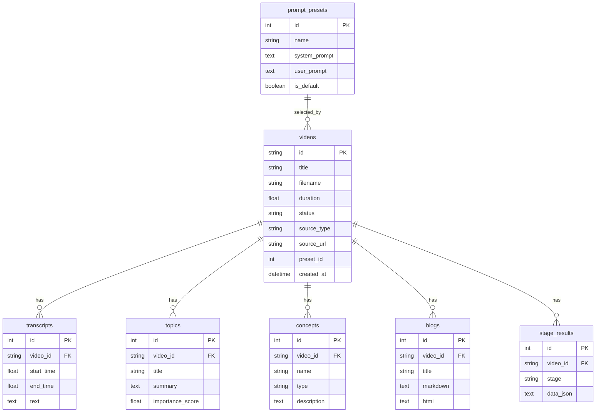

## API 接口

启动后访问 `http://localhost:8001/docs` 可查看完整 OpenAPI 文档。

| 方法 | 路径 | 说明 |
| --- | --- | --- |
| `POST` | `/api/upload` | 上传视频/音频文件，创建待处理任务 |
| `POST` | `/api/upload/url` | 提交 URL，创建待处理任务 |
| `POST` | `/api/task/{task_id}/start` | 启动任务，可传入 `asr_provider` |
| `POST` | `/api/task/{task_id}/cancel` | 取消任务 |
| `GET` | `/api/task/{task_id}` | 查询任务状态 |
| `GET` | `/api/task/{task_id}/stream` | SSE 实时事件流 |
| `GET` | `/api/task/{task_id}/events` | 获取历史 SSE 事件 |
| `GET` | `/api/videos` | 获取资产列表，支持搜索和状态筛选 |
| `GET` | `/api/videos/{video_id}` | 获取资产详情 |
| `DELETE` | `/api/videos/{video_id}` | 删除资产及相关数据 |
| `POST` | `/api/videos/{video_id}/reprocess` | 重新处理完整流水线 |
| `POST` | `/api/videos/{video_id}/regenerate-blog` | 仅重新生成文章 |
| `GET` | `/api/stage/{video_id}/{stage}` | 获取指定阶段结果 |
| `GET` | `/api/audio/{video_id}` | 获取 WAV 音频文件 |
| `GET` | `/api/video/{video_id}` | 获取原始视频文件 |
| `POST` | `/api/export/md` | 导出 Markdown |
| `POST` | `/api/export/srt` | 导出 SRT |
| `POST` | `/api/export/txt` | 导出 TXT |
| `POST` | `/api/export/json` | 导出 JSON |
| `GET/PUT` | `/api/prompts/{template_id}` | 读取或更新 Prompt 模板 |
| `GET/POST/PUT/DELETE` | `/api/presets` | 管理 Prompt 预设 |

### SSE 事件

| 事件 | 说明 |
| --- | --- |
| `step_start` | 某个阶段开始 |
| `step_progress` | 阶段进度或流式生成 chunk |
| `step_result` | 阶段完成并返回结果 |
| `step_error` | 阶段失败 |
| `complete` | 全流程完成 |
| `cancelled` | 任务被取消 |
| `ping` | 连接保活 |

## 性能与扩展性

- **主要耗时**：ASR 转录和 LLM 生成。CPU Whisper 适合低成本本地部署，GPU 可显著加速。
- **长音频处理**：MIMO-ASR 通过分片和并发降低单次请求体积与失败概率。
- **结果复用**：重新生成文章时可复用已有转录、章节和知识结果，不必重复跑完整流水线。
- **单机优先**：当前使用 SQLite 和本地文件系统，适合个人或小团队单机部署。
- **扩展方向**：后续可引入任务队列、对象存储、PostgreSQL 或 Worker，将单机流水线扩展为服务化架构。

## 安全设计

- **密钥隔离**：`.env` 被 `.gitignore` 排除，仓库只保留 `.env.example`。
- **文件隔离**：上传文件、标准音频、导出结果和 SQLite 数据库统一保存在 `storage/`。
- **Prompt 注入防护**：内置 Prompt 要求模型忽略转录数据中的指令性文本。
- **CORS 限制**：后端默认只允许 `http://localhost:3002` 访问。
- **任务取消**：流水线关键节点检查取消状态，避免继续执行无意义的后续处理。

## 项目亮点

1. **产品定位更完整**：从“生成博客”升级为“沉淀视频知识资产”，中间结果和最终文章同样可复用。
2. **输入层解耦**：视频、音频、URL 在入口统一标准化，后续 AI 流程只处理 WAV 和文本。
3. **阶段结果可见**：每个阶段都通过 SSE 和 `stage_results` 暴露，便于调试、复用和导出。
4. **Prompt 产品化**：Prompt 不只是写死在代码里，而是支持模板编辑和预设管理。
5. **长音频友好**：MIMO-ASR 分片并发、重试和心跳事件让长音频处理更可控。

## Roadmap

- [x] 视频、音频、URL 多源输入
- [x] Whisper 本地转录
- [x] MIMO-ASR 分片并发转录
- [x] DeepSeek 章节划分、知识提取、文章生成
- [x] SSE 实时进度和历史事件回放
- [x] Prompt 模板编辑与预设管理
- [x] 资产管理、重新处理、仅重新生成文章
- [x] Markdown/SRT/TXT/JSON 导出
- [ ] 批量任务队列与任务优先级
- [ ] Docker / Docker Compose 部署
- [ ] PostgreSQL 或对象存储适配
- [ ] 文章质量评分与自动二次润色
- [ ] 多语言知识资产与多格式内容生成

## 贡献指南

欢迎提交 Issue 和 Pull Request。建议遵循以下流程：

```bash
git checkout -b feature/your-feature
git commit -m "feat: add your feature"
git push origin feature/your-feature
```

提交信息建议使用 Conventional Commits：

| 类型 | 说明 |
| --- | --- |
| `feat` | 新功能 |
| `fix` | Bug 修复 |
| `docs` | 文档更新 |
| `refactor` | 重构 |
| `chore` | 构建、依赖或工具调整 |

本地检查：

```powershell
# 后端语法检查
cd backend
python -m compileall app

# 前端 lint
cd frontend
npm run lint
```

## FAQ

### 为什么项目叫 Video2Knowledge，而不是 Video2TechBlog？

因为当前产品已经不只生成技术博客。它会沉淀音频、转录、章节、知识 JSON 和文章等多类资产，博客只是知识资产的一种发布形态。

### 没有 GPU 可以运行吗？

可以。Whisper 会自动回退到 CPU + int8，速度会慢一些，但功能完整。也可以选择 MIMO-ASR，把转录交给云端接口。

### URL 下载失败怎么办？

优先检查链接是否公开可访问。部分平台需要登录 cookies，可以导出 cookies 文件并在 `backend/.env` 中设置 `YTDLP_COOKIES_PATH`。

### 为什么上传后还要点击开始处理？

上传接口只负责保存输入和创建任务，处理由 `/api/task/{id}/start` 触发。这样前端可以在开始前选择 ASR 模型和 Prompt 预设。

### 可以只重新生成文章吗？

可以。资产详情页支持“仅重新生成文章”，会复用已有转录、章节和知识结果，只重新运行文章生成阶段。

### 支持其他 LLM 吗？

当前代码使用 DeepSeek 的 OpenAI 兼容接口。要替换为其他兼容服务，需要修改 `backend/app/config.py` 中的模型名和 Base URL，并确认返回格式兼容。

## License

本项目基于 [MIT License](LICENSE) 开源。
