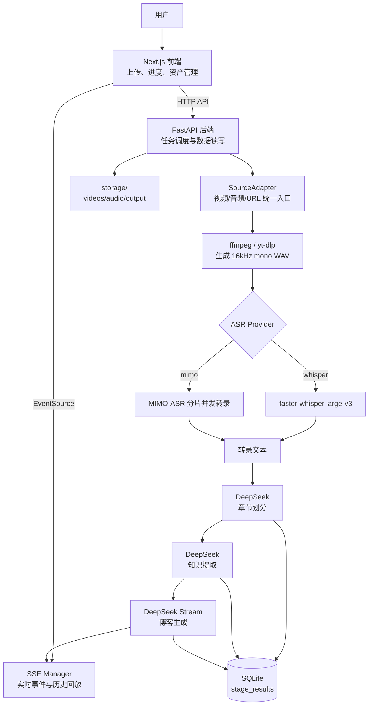
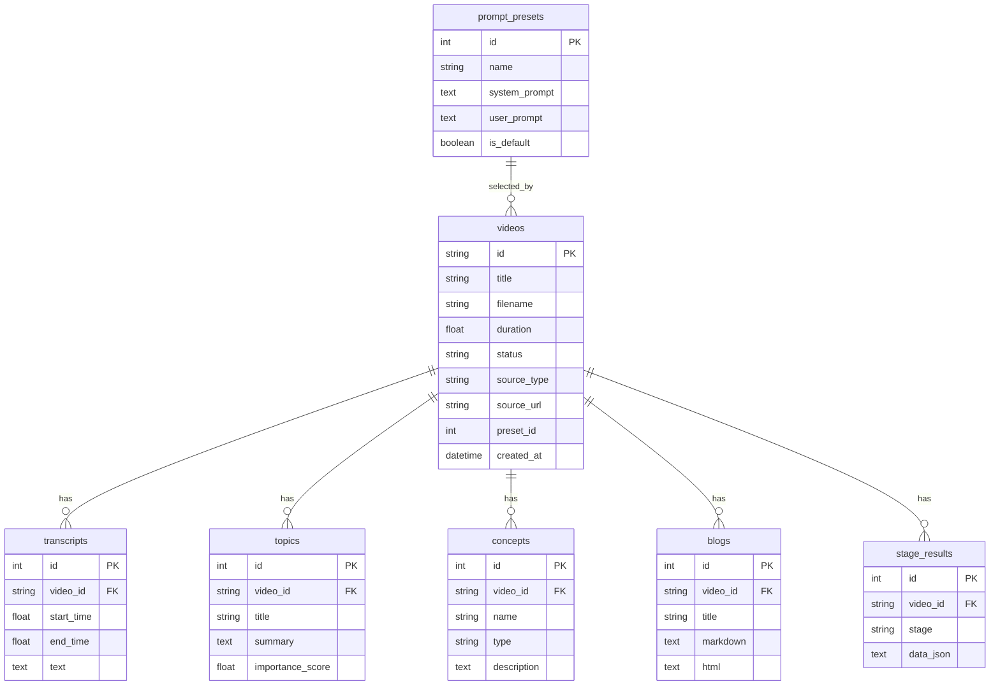

# Video2TechBlog

> 将技术视频、音频或在线视频链接自动转换为可发布的中文技术博客。

[](https://www.python.org/)
[](https://fastapi.tiangolo.com/)
[](https://www.sqlite.org/)
[](https://nextjs.org/)
[](https://react.dev/)
[](https://tailwindcss.com/)
[](LICENSE)

---

## 项目简介

技术视频里常常包含高密度信息：会议演讲、课程录屏、产品讲解、源码分析、团队分享。问题是，视频内容不方便搜索、不方便引用，也很难快速沉淀到团队知识库或个人博客中。

Video2TechBlog 提供一条从媒体输入到文章输出的 AI 流水线。用户可以上传视频/音频文件，或粘贴 Bilibili、YouTube 等平台链接；系统会统一抽取音频、执行语音转录、识别章节、提取结构化知识，并最终流式生成 Markdown 技术博客。整个处理过程通过 SSE 实时推送，前端可以看到每个阶段的进度与中间结果。

这个项目适合希望把视频知识转化为可检索、可编辑、可发布文本资产的开发者、内容创作者、技术团队和学习者。

## 核心能力

### 多源媒体输入

支持本地视频、本地音频和 URL 三类输入。`SourceAdapter` 将不同来源统一转换为 16kHz mono WAV，后续 AI 流水线不需要关心原始输入类型。

### 双语音识别后端

默认使用 `faster-whisper large-v3`，自动检测 CUDA 并回退到 CPU int8。也可以在前端切换到 MIMO-ASR；MIMO 路径会把长音频切成 MP3 分片，并发请求接口，降低单次请求体大小和长音频失败概率。

### AI 章节划分与知识提取

DeepSeek LLM 会根据转录文本识别章节结构，并抽取概念、框架、方法、工具、论文、代码示例和洞察等结构化知识，为后续博客生成提供更稳定的上下文。

### 流式博客生成

博客生成阶段使用 DeepSeek 流式接口，后端通过线程 + `asyncio.Queue` 桥接同步 HTTP 流和异步 SSE 事件，前端可以实时显示生成中的 Markdown 内容。

### Prompt 模板与预设管理

系统内置章节划分、知识提取、博客生成 System/User Prompt，并支持在前端可视化编辑。用户还可以创建多套博客生成预设，用于不同写作风格或内容场景。

### 资产管理与多格式导出

处理完成的视频会进入资产列表，支持搜索、状态筛选、查看详情、重新处理、仅重新生成博客、删除，以及导出 Markdown、SRT、TXT、JSON。

## 效果展示

### 资产界面


### 处理进度


### 阶段结果

| 音频提取 | 音频转录 | 章节划分 |
| :---: | :---: | :---: |
|  |  |  |

| 知识提取 | 最终博客 |
| :---: | :---: |
|  |  |

## 应用场景

- **会议演讲整理**：把技术大会、直播回放或内部分享转换成发布稿，便于会后传播。
- **课程内容沉淀**：将教程视频转换为图文笔记，提升搜索、复习和引用效率。
- **团队知识库建设**：把录屏和口头分享沉淀为结构化文档，减少重复讲解。
- **个人学习归档**：把长视频拆成章节、知识点和总结，形成可复习的学习资料。
- **内容创作复用**：将视频素材快速转换为博客、字幕、摘要或 JSON 数据。

## 安装部署

### 环境要求

| 依赖 | 建议版本 | 用途 |
| --- | --- | --- |
| Windows PowerShell | 5+ | 运行一键启动脚本 |
| Conda / Miniconda | 最新稳定版 | 管理 Python 3.10 环境 |
| Node.js | 18+ | 前端开发与构建 |
| ffmpeg / ffprobe | 最新稳定版 | 音视频抽取、转码、时长探测 |
| DeepSeek API Key | 必需 | 章节划分、知识提取、博客生成 |
| MIMO API Key | 可选 | 使用 MIMO-ASR 时需要 |

### 方式一：让 AI 帮你安装

把下面这段话复制给你的 AI 编程助手：

```text
请帮我在 Windows 上运行 Video2TechBlog：
1. 检查 Conda、Node.js、ffmpeg 是否可用；
2. 如果缺少依赖，请给出安装建议；
3. 复制 backend/.env.example 为 backend/.env，并提醒我填写 DEEPSEEK_API_KEY；
4. 执行 .\start.ps1 启动后端 8001 和前端 3002；
5. 启动成功后告诉我访问 http://localhost:3002。
```

### 方式二：脚本自动启动

```powershell
git clone https://github.com/guyue356/Video2TechBlog.git
cd Video2TechBlog
copy backend\.env.example backend\.env
# 编辑 backend\.env，填入 DEEPSEEK_API_KEY
.\start.ps1
```

脚本会自动：

1. 检查 Conda、Node.js、ffmpeg；
2. 创建 `video2techblog` Conda 环境；
3. 安装 Python 与 Node.js 依赖；
4. 启动 FastAPI 后端 `http://localhost:8001`；
5. 启动 Next.js 前端 `http://localhost:3002`。

停止服务：

```powershell
.\stop.ps1
```

### 方式三：手动启动

```powershell
# 后端
cd backend
conda create -n video2techblog python=3.10 -y
conda activate video2techblog
pip install -r requirements.txt
uvicorn app.main:app --reload --port 8001
```

```powershell
# 前端
cd frontend
npm install
npm run dev
```

启动后访问：

- 前端应用：http://localhost:3002
- API 文档：http://localhost:8001/docs

## 快速开始

1. 启动服务并打开 `http://localhost:3002`。
2. 选择 Prompt 预设和语音识别模型：`Whisper` 或 `MIMO-ASR`。
3. 上传视频/音频文件，或粘贴 URL 链接。
4. 点击开始处理，等待音频抽取、转录、章节、知识和博客生成完成。
5. 在结果页查看 Markdown 博客，并按需导出 `md`、`srt`、`txt` 或 `json`。

## 使用说明

### 输入方式

| 输入类型 | 说明 |
| --- | --- |
| 视频文件 | 支持常见视频格式，后端通过 ffmpeg 抽取音频 |
| 音频文件 | 支持常见音频格式，统一转为 WAV |
| URL 链接 | 通过 yt-dlp 下载音频，适合 Bilibili、YouTube 等平台 |

部分平台需要登录态或会员权限，可以通过 `YTDLP_COOKIES_PATH` 指定 cookies 文件。

### 处理阶段

| 阶段 | 输出 |
| --- | --- |
| `extract_audio` | 标准 WAV 音频、媒体时长 |
| `transcribe` | 带时间戳的转录文本和分段列表 |
| `segment_chapters` | 章节标题、摘要、时间范围、重要性评分 |
| `extract_knowledge` | 结构化知识 JSON |
| `generate_blog` | Markdown 博客正文和标题 |

### 导出格式

| 格式 | 用途 |
| --- | --- |
| Markdown | 发布到博客、GitHub、知识库 |
| SRT | 字幕文件 |
| TXT | 纯文本转录或正文 |
| JSON | 阶段结果、知识结构和自动化集成 |

## 系统架构



前端负责用户交互和阶段结果展示；后端负责媒体适配、任务生命周期、AI 调用和持久化；SSE Manager 维护每个任务的事件队列和历史事件，支持刷新页面后的进度回放。

## 核心工作流程


1. **创建任务**：上传接口只保存输入并创建 `pending` 任务，真正处理由 `/api/task/{id}/start` 触发。
2. **输入适配**：`VideoFileAdapter`、`AudioFileAdapter`、`UrlAdapter` 将来源统一转换成 WAV。
3. **语音转录**：按用户选择使用 Whisper 或 MIMO-ASR。MIMO-ASR 会自动分片、并发、重试，并在必要时支持串行 fallback。
4. **LLM 分析**：章节划分和知识提取使用非流式 DeepSeek 请求，当前默认 `max_tokens=8192`。
5. **博客生成**：使用流式 DeepSeek 请求，当前博客路径显式传入 `max_tokens=380000`。
6. **结果持久化**：每个阶段的完整 JSON 保存到 `stage_results`，博客保存到 `blogs`，资产页可重复查看。

## AI 工作流

### Prompt Pipeline


### Prompt 设计要点

- 转录内容会包裹在 `<transcript>` 等 XML 标签中，提示词明确要求模型把标签内文本视为原始数据。
- 章节和知识阶段要求模型返回 JSON，后端会尝试剥离 Markdown code fence 后再解析。
- 博客生成阶段由 System Prompt 定义写作角色和输出要求，User Prompt 注入章节、知识和转录文本。
- Prompt 模板存储在 `prompt_templates` 表中，预设存储在 `prompt_presets` 表中，支持前端热更新。

## 技术栈

| 层级 | 技术 | 用途 | 选型理由 |
| --- | --- | --- | --- |
| 前端 | Next.js 16 + React 19 | 单页 Web 应用 | App Router、React 生态成熟 |
| 前端样式 | Tailwind CSS 4 | UI 样式 | 快速构建响应式界面 |
| Markdown | react-markdown + remark-gfm + rehype-highlight | 博客渲染 | 支持 GFM 与代码高亮 |
| 后端 | FastAPI + Uvicorn | API 与 SSE 服务 | 原生 async、OpenAPI 文档友好 |
| 数据库 | SQLite + SQLAlchemy async | 本地持久化 | 零运维，适合单机桌面工作流 |
| 语音识别 | faster-whisper large-v3 | 本地 ASR | 可用 CPU/GPU，部署成本低 |
| 语音识别 | MIMO-ASR | 云端 ASR | 长音频分片并发，适合替代本地转录 |
| LLM | DeepSeek API | 章节、知识、博客生成 | OpenAI 兼容接口，中文写作表现好 |
| 媒体处理 | ffmpeg / ffprobe | 抽音频、转码、探测时长 | 音视频处理事实标准 |
| URL 下载 | yt-dlp | 平台链接下载 | 覆盖平台广，维护活跃 |
| 实时进度 | sse-starlette + EventSource | 推送处理状态 | 简单稳定，适合单向任务流 |

## 项目结构

```text
Video2TechBlog/
├── backend/                         # FastAPI 后端
│   ├── app/
│   │   ├── main.py                  # API 路由、任务调度、导出接口
│   │   ├── config.py                # 路径、模型、ASR 与环境变量配置
│   │   ├── models/
│   │   │   ├── database.py          # SQLAlchemy 表结构与初始化
│   │   │   └── schemas.py           # Pydantic 请求/响应模型
│   │   └── pipeline/
│   │       ├── sources.py           # 多源输入适配器
│   │       ├── nodes.py             # AI 流水线节点
│   │       ├── sse_manager.py       # SSE 队列和历史事件管理
│   │       └── graph.py             # 兼容入口
│   ├── requirements.txt             # Python 依赖
│   └── .env.example                 # 环境变量模板
├── frontend/                        # Next.js 前端
│   ├── src/app/
│   │   ├── page.tsx                 # 主界面：上传、处理、资产管理
│   │   ├── StageViewer.tsx          # 阶段结果展示与导出按钮
│   │   ├── MarkdownRenderer.tsx     # Markdown 渲染
│   │   ├── PromptSettings.tsx       # Prompt 模板编辑
│   │   ├── PresetSelector.tsx       # Prompt 预设选择
│   │   ├── PresetManager.tsx        # Prompt 预设管理
│   │   └── useStageData.ts          # 阶段数据加载 Hook
│   └── package.json                 # 前端依赖与脚本
├── storage/                         # 运行时数据，已 gitignore
│   ├── videos/                      # 上传视频
│   ├── audio/                       # 标准化音频
│   ├── output/                      # 导出文件
│   └── app.db                       # SQLite 数据库
├── Assets/                          # README 截图
├── docs/                            # 设计与方案文档
├── start.ps1                        # Windows 一键启动
├── stop.ps1                         # Windows 停止脚本
├── AGENTS.md                        # Codex 项目指引
├── CLAUDE.md                        # Claude 项目指引
└── LICENSE                          # MIT License
```

## 配置说明

主要配置位于 `backend/app/config.py`，运行时通过 `backend/.env` 覆盖。

| 变量 | 必需 | 默认值 | 说明 |
| --- | --- | --- | --- |
| `DEEPSEEK_API_KEY` | 是 | 空 | DeepSeek API Key |
| `MIMO_API_KEY` | 否 | 空 | MIMO-ASR API Key，选择 MIMO 时必填 |
| `MIMO_BASE_URL` | 否 | 根据 Key 自动选择 | MIMO API 地址，`tp-` Key 默认使用 token-plan-cn 地址 |
| `MIMO_ASR_MODEL` | 否 | `mimo-v2.5-asr` | MIMO-ASR 模型名 |
| `MIMO_ASR_LANGUAGE` | 否 | `WHISPER_LANGUAGE` 或 `zh` | MIMO-ASR 识别语言 |
| `MIMO_ASR_CHUNK_SECONDS` | 否 | `180` | MIMO 分片长度，过大可能超过 10MB base64 限制 |
| `MIMO_ASR_MP3_BITRATE` | 否 | `32k` | MIMO 分片 MP3 比特率 |
| `MIMO_ASR_CONCURRENCY` | 否 | `3` | MIMO 并发请求数 |
| `MIMO_ASR_TIMEOUT_SECONDS` | 否 | `90` | 单次 MIMO 请求超时 |
| `MIMO_ASR_MAX_ATTEMPTS` | 否 | `2` | MIMO 单片重试次数 |
| `MIMO_ASR_HEARTBEAT_SECONDS` | 否 | `10` | 长请求等待时的 SSE 心跳间隔 |
| `MIMO_ASR_FALLBACK_RETRY` | 否 | `0` | 是否对失败分片启用串行 fallback |
| `WHISPER_LANGUAGE` | 否 | `zh` | Whisper 识别语言，留空可自动检测 |
| `YTDLP_COOKIES_PATH` | 否 | 空 | yt-dlp cookies 文件路径 |

DeepSeek 模型当前在代码中设置为 `deepseek-v4-flash`，Base URL 为 `https://api.deepseek.com/v1`。如需替换为其他 OpenAI 兼容服务，可以修改 `backend/app/config.py` 中的 `DEEPSEEK_BASE_URL` 和 `DEEPSEEK_MODEL`。

## 数据库设计



## API 接口

启动后访问 `http://localhost:8001/docs` 可查看完整 OpenAPI 文档。

| 方法 | 路径 | 说明 |
| --- | --- | --- |
| `POST` | `/api/upload` | 上传视频/音频文件，创建待处理任务 |
| `POST` | `/api/upload/url` | 提交 URL，创建待处理任务 |
| `POST` | `/api/task/{task_id}/start` | 启动任务，可传入 `asr_provider` |
| `POST` | `/api/task/{task_id}/cancel` | 取消任务 |
| `GET` | `/api/task/{task_id}` | 查询任务状态 |
| `GET` | `/api/task/{task_id}/stream` | SSE 实时事件流 |
| `GET` | `/api/task/{task_id}/events` | 获取历史 SSE 事件 |
| `GET` | `/api/videos` | 获取资产列表，支持搜索和状态筛选 |
| `GET` | `/api/videos/{video_id}` | 获取资产详情 |
| `DELETE` | `/api/videos/{video_id}` | 删除资产及相关数据 |
| `POST` | `/api/videos/{video_id}/reprocess` | 重新处理完整流水线 |
| `POST` | `/api/videos/{video_id}/regenerate-blog` | 仅重新生成博客 |
| `GET` | `/api/stage/{video_id}/{stage}` | 获取指定阶段结果 |
| `GET` | `/api/audio/{video_id}` | 获取音频文件 |
| `GET` | `/api/video/{video_id}` | 获取原始视频文件 |
| `POST` | `/api/export/md` | 导出 Markdown |
| `POST` | `/api/export/srt` | 导出 SRT |
| `POST` | `/api/export/txt` | 导出 TXT |
| `POST` | `/api/export/json` | 导出 JSON |
| `GET/PUT` | `/api/prompts/{template_id}` | 读取/更新 Prompt 模板 |
| `GET/POST/PUT/DELETE` | `/api/presets` | 管理 Prompt 预设 |

### SSE 事件

| 事件 | 说明 |
| --- | --- |
| `step_start` | 某个阶段开始 |
| `step_progress` | 阶段进度或博客流式 chunk |
| `step_result` | 阶段完成并返回结果 |
| `step_error` | 阶段失败 |
| `complete` | 全流程完成 |
| `cancelled` | 任务被取消 |
| `ping` | 连接保活 |

## 性能与扩展性

- **主要耗时**：ASR 转录和 LLM 生成。CPU Whisper 适合低成本本地部署，GPU 可显著加速。
- **MIMO-ASR 扩展**：通过分片和并发减少长音频失败概率，适合希望把转录工作交给云端模型的场景。
- **LLM 成本**：章节、知识、博客三次主要调用消耗 token；博客生成阶段当前允许更长输出。
- **任务并发**：FastAPI 可并发处理多个任务，但当前使用本地 SQLite 和文件系统，更适合个人或小团队单机部署。
- **后续扩展**：可以引入队列、对象存储、PostgreSQL 或任务 Worker，将单机流水线扩展为服务化架构。

## 安全设计

- **密钥隔离**：`.env` 被 `.gitignore` 排除，仓库只保留 `.env.example`。
- **文件隔离**：上传文件、音频、输出和 SQLite 数据库均保存在 `storage/`，按 task id 管理。
- **Prompt 注入防护**：内置 Prompt 明确要求模型忽略转录数据中的指令性文本。
- **CORS 限制**：后端默认只允许 `http://localhost:3002` 访问。
- **任务取消**：流水线关键节点检查取消状态，避免不必要的后续处理。

## 项目亮点

1. **工程路径清晰**：没有引入复杂编排框架，核心流水线由一组 async 节点串联，便于调试和扩展。
2. **输入层解耦**：视频、音频、URL 在入口层归一化，后续 AI 流程只处理标准 WAV 和文本。
3. **中间结果可见**：每个阶段都通过 SSE 和 `stage_results` 暴露，便于定位问题和复用结果。
4. **Prompt 产品化**：Prompt 不只是写死在代码里，而是支持模板编辑和预设管理。
5. **长音频友好**：MIMO-ASR 分片并发、重试和心跳事件让长音频处理更可控。

## Roadmap

- [x] 视频/音频/URL 多源输入
- [x] Whisper 本地转录
- [x] MIMO-ASR 分片并发转录
- [x] DeepSeek 章节划分、知识提取、博客生成
- [x] SSE 实时进度和历史事件回放
- [x] Prompt 模板编辑与预设管理
- [x] 资产管理、重新处理、仅重新生成博客
- [x] Markdown/SRT/TXT/JSON 导出
- [ ] 批量任务队列与任务优先级
- [ ] Docker / Docker Compose 部署
- [ ] PostgreSQL 或对象存储适配
- [ ] 博客质量评分与自动二次润色
- [ ] 多语言博客生成预设

## 贡献指南

欢迎提交 Issue 和 Pull Request。建议遵循以下流程：

```bash
git checkout -b feature/your-feature
git commit -m "feat: add your feature"
git push origin feature/your-feature
```

提交信息建议使用 Conventional Commits：

| 类型 | 说明 |
| --- | --- |
| `feat` | 新功能 |
| `fix` | Bug 修复 |
| `docs` | 文档更新 |
| `refactor` | 重构 |
| `chore` | 构建、依赖或工具调整 |

本地检查：

```powershell
# 后端语法检查
cd backend
python -m compileall app

# 前端 lint
cd frontend
npm.cmd run lint
```

## FAQ

### 没有 GPU 可以运行吗？

可以。Whisper 会自动回退到 CPU + int8，速度会慢一些，但功能完整。也可以选择 MIMO-ASR，把转录交给云端接口。

### URL 下载失败怎么办？

优先检查链接是否公开可访问。部分平台需要登录 cookies，可以导出 cookies 文件并在 `backend/.env` 中设置 `YTDLP_COOKIES_PATH`。

### 为什么已经上传了文件，还要点击开始处理？

上传接口只负责保存输入和创建任务，处理由 `/api/task/{id}/start` 触发。这样前端可以在开始前选择 ASR 模型和 Prompt 预设。

### 可以只重新生成博客吗？

可以。资产详情页支持“仅重新生成博客”，会复用已有转录、章节和知识结果，只重新运行博客生成阶段。

### 支持其他 LLM 吗？

当前代码使用 DeepSeek 的 OpenAI 兼容接口。要替换为其他兼容服务，需要修改 `backend/app/config.py` 中的模型名和 Base URL，并确认返回格式兼容。

### MIMO-ASR 分片仍然超过 10MB 怎么办？

降低 `MIMO_ASR_CHUNK_SECONDS` 或 `MIMO_ASR_MP3_BITRATE`。代码会自动把分片长度逐步降到 30 秒；如果仍超限，需要进一步降低比特率。

## License

本项目基于 [MIT License](LICENSE) 开源。
